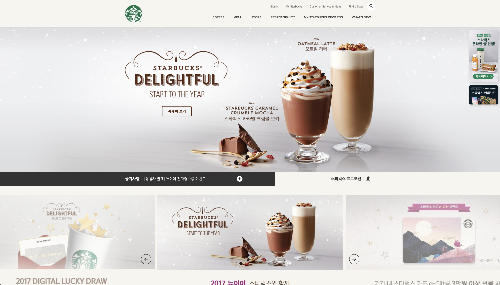
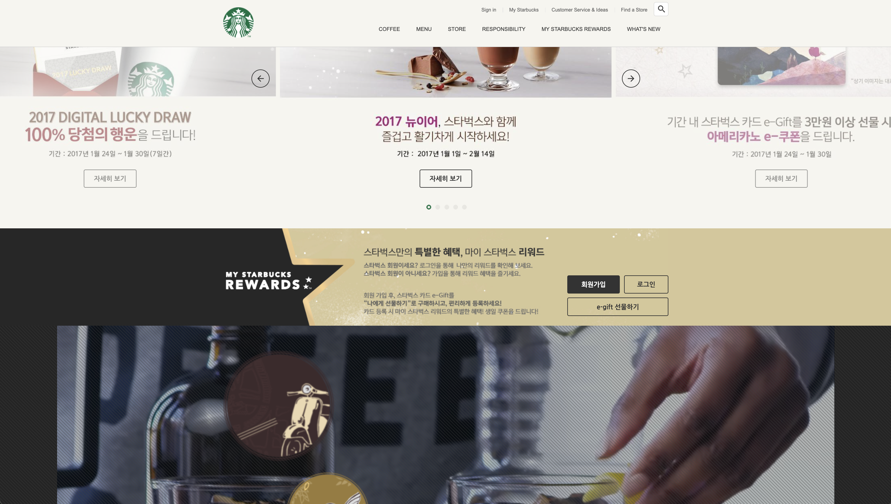

# 다중 애니메이션과 슬라이드 기반 UI 구현  
[스타벅스 홈페이지](https://hyunji1117.github.io/StarBucks_clone-240919-.github.io/)

##### 참여자: 김현지 (개인 프로젝트)  
  
#### 프로젝트 기간: 2024.09.19 ~ 2024.10.08 (3주)  
  
#### 프로젝트 도구: Material Icons, CSS 애니메이션, Swiper.js, GSAP, iframe API
  
#### 사용 언어: Html, Css, Javascript  
  
### 프로젝트 개요  
  - API 기반 웹페이지 제작 및 UI 구현:  
스타벅스 웹페이지 클론 프로젝트로, 다양한 JavaScript 및 CSS 라이브러리를 활용해 동적인 사용자 경험(UX)을 제공하는 인터페이스를 구현.
  - YouTube Iframe API 연동:  
유튜브 Iframe API와 Swiper.js를 통해 슬라이드 및 동영상 재생 기능 구현.  
  
### 프로젝트 배경  
#### 생동감 있는 웹 경험을 위한 인터랙티브 UI 구현: 애니메이션과 스크롤 효과로 몰입도 향상
  - Swiper.js를 이용한 수직 슬라이드 기능
  - GSAP을 통한 애니메이션 효과
  - Parallax 스크롤을 통한 뷰포트에 배경 고정  
#### 유저 경험을 극대화한 정보 제공 시스템 구축: 미래 확장성을 고려한 스타벅스 웹 서비스 스터디
  - 스타벅스의 다양한 서비스 정보 이용 가능하도록 정보 군집화 
  - 추후 회원가입 및 로그인 기능 구축에 해당 UI/UX 기반 인터페이스 활용  
  
### 프로젝트 진행 과정  
1. **기초 설계 및 구조화**
  - HTML을 활용해 웹페이지의 기본적인 구조를 설계하고, 각 섹션 정의.
  - 스타벅스 웹페이지의 다양한 서비스와 기능을 효율적으로 담기 위해 메뉴, 서브메뉴, 로고, 배너 등 구조화.

2. **스타일링 및 레이아웃 설정**
  - CSS로 웹페이지의 스타일링 작업을 진행하여 전체적인 레이아웃 완성.
  - Material Icons와 Google Fonts를 적용해 시각적인 완성도를 높이고, 반응형 레이아웃을 통해 다양한 화면 해상도에서 적응 가능한 구조 설계.

3. **애니메이션 및 슬라이드 기능 구현**
  - GSAP을 활용하여 요소의 등장 및 사라짐을 애니메이션화하고, Swiper.js를 통해 수직 슬라이드 기능을 구현하여 동적인 사용자 경험 강화.
  - Parallax 스크롤을 적용해 배경이 뷰포트에 고정되도록 하여 더욱 깊이감 있는 스크롤 효과 제공.

4. **API 및 외부 라이브러리 연동**
  - YouTube Iframe API를 사용하여 웹페이지에 동영상을 삽입하고, Swiper.js와 같은 외부 라이브러리를 이용해 슬라이드 기능 동작시킴.
  - 추후 확장을 고려해 다양한 외부 API 연동 가능성 검토 필요.

5. **유저 경험 최적화 및 디버깅**
  - GSAP, Swiper.js, 검색 기능 등을 테스트하며 사용자 인터랙션에 최적화된 UI/UX 구현.
  - 스크롤 이벤트, 버튼 호버 효과 등 다양한 동작을 테스트하며 디버깅 진행, 반응 속도와 사용자 편의성 개선 예상.

  

  
  

  

  
  

  

  
  

  

